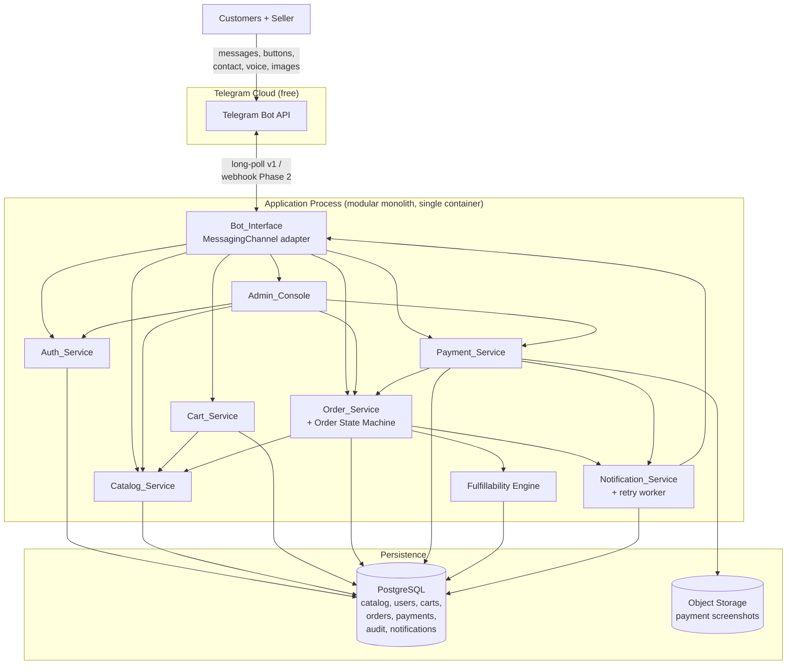
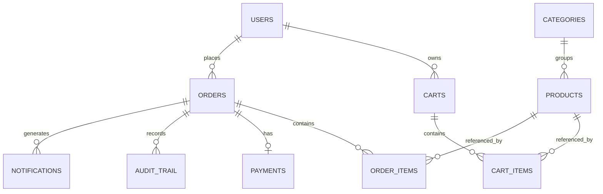
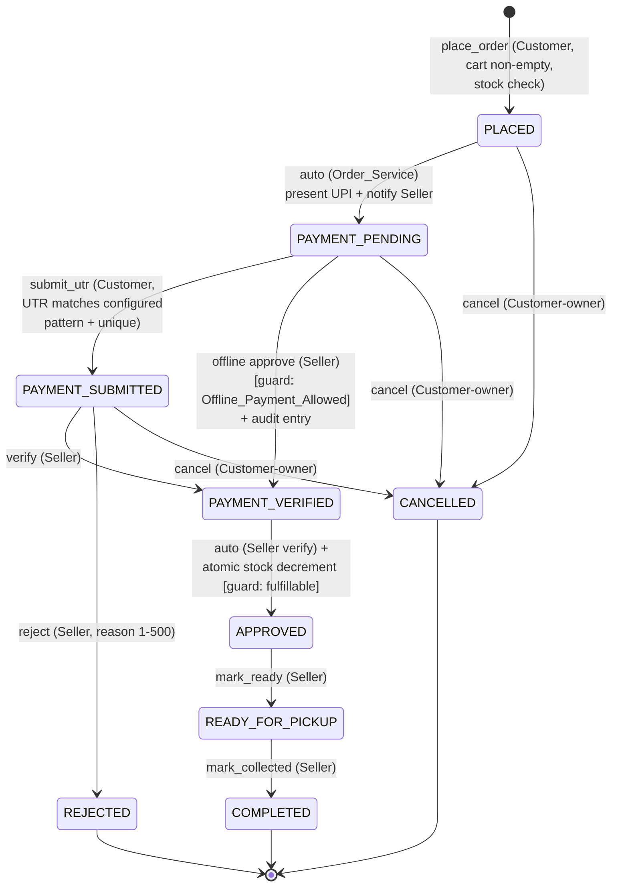

# Design Document

## Overview

This document describes the technical design for the **Cotton Seed Oil Cake Marketplace**, a single-vendor ordering system delivered as a Telegram bot for v1. It is built by a solo developer (the Seller's nephew) for one Seller (also the Admin) and tens-to-thousands of predominantly elderly Customers in rural India.

The design is driven by three over-arching goals taken directly from the requirements and the stakeholder:

1. **Minimal cost** for both development and hosting, with a credible path to scale (Requirement 13). The starting configuration should cost effectively ₹0 and grow only when real load arrives.
2. **Stable, versioned data formats** so the platform can later add WhatsApp, a web/PWA front end, voice-AI, and a payment gateway *without changing stored data* (Req 13.7, 13.8).
3. **Extreme UX simplicity** for elderly users: inline keyboards and buttons over free-text entry wherever possible, plus a voice-message baseline (Req 14).

### Branding

The product is presented to users under a consistent brand:

- **Product name:** **Jan Purna** (Devanagari: **जन पूर्णा**). **Short name / monogram:** **JP**.
- **Bot identity & onboarding messaging:** The bot's display name and all welcome/onboarding copy use the Jan Purna / JP branding. For example, the `/start` welcome introduces the service as "Jan Purna (जन पूर्णा)" before presenting the Share Contact action (Req 1.1/1.5), so the very first interaction carries the brand.
- **Logo guidance (assets to be provided — no image processing in code):**
  - The **full stacked lockup** (farm-sunrise icon + **JP** monogram + **जन पूर्णा** wordmark) is intended for the in-chat welcome message and a future Mini App splash screen.
  - A **circle-safe square variant** (the **JP** monogram alone) should be used for the **bot profile photo**, because Telegram crops avatars to a circle and a stacked wordmark would be clipped.
  - Both assets are to be **provided externally** as transparent PNGs (~1024×1024, square, with equal padding so the circle crop stays balanced). This is design guidance only; the application performs no image generation or manipulation.
- **Centralized, configurable branding strings:** All brand strings (product name "Jan Purna", Devanagari form "जन पूर्णा", short name "JP", and any taglines) are kept in a single centralized configuration/constants module rather than hard-coded across handlers. This keeps the branding easy to reuse and update across the Telegram bot today and a future WhatsApp / web channel (Phase 2) without touching domain services or stored data.

### Language and Localization (Req 18)

The System **fully supports two presentation languages — Hindi and English** — with **complete Message_Catalog coverage in both**: every prompt, confirmation, error, notification, and button label exists in both Hindi and English (Req 18.1, 18.6). No user-facing string is hard-coded in handlers; every string is sourced from a centralized **Message_Catalog** and looked up by a stable string key plus the active language code, so the presentation language can be switched (or further languages added later) **without changing domain logic or stored data** (Req 18.2, 18.5).

- **Hindi default for unset preference:** **Hindi is the default language for any user with no stored preference** (a new or unknown user), because the audience is predominantly elderly rural Hindi speakers; an unset/NULL `Language_Preference` is treated as Hindi (Req 18.2).
- **User-switchable at any time:** Users can **switch the presentation language between Hindi and English at any time** via a language-switch control (a button and/or a command — see Bot_Interface). The control is available to **both Customers and the Seller** (Req 18.3, 18.8).
- **Persisted per-user choice:** When a user selects a language, the System **persists that choice as a per-user `Language_Preference`** and renders all subsequent customer-facing content in the selected language until the user changes it again (Req 18.4, 18.5). The preference lives on the user record (see Data Models → Users).
- **Brand strings vs. catalog strings:** The branding-strings module (above) and the Message_Catalog work **together** but are distinct. Brand strings ("Jan Purna", "जन पूर्णा", "JP") are **language-independent** and are rendered identically in both Hindi and English (Req 18.7). The Message_Catalog holds the translatable surrounding copy and may embed the brand strings by reference.
- **Graceful fallback (prefers Hindi):** Both languages are fully populated, but if a requested string is ever missing for the active language, the lookup falls back to the **other supported language, preferring Hindi**, rather than blocking, aborting, or suspending the flow (Req 18.6, 18.9).
- **Presentation-layer placement:** The Message_Catalog lives **entirely in the presentation layer** — inside the Telegram `MessagingChannel` adapter / a shared `i18n` module. **Domain services (Auth, Catalog, Cart, Order, Payment, Notification, Admin) stay language-agnostic**: they return typed results and stable status/error **codes**, never localized prose, and the Bot_Interface renders those codes into the user's active language via the catalog. This preserves the channel/i18n seam so WhatsApp / web / Mini App reuse the same domain codes (Phase 2).
- **Versioned resource:** The Message_Catalog is a **versioned asset** carrying a `format_version`, consistent with the stable-versioned-format rule (Req 13.7). New keys/languages are **additive**; older catalog payloads remain readable, mirroring the additive-schema strategy used for stored data.

### Key Design Decisions (Summary)

| Decision | Choice | Rationale |
|---|---|---|
| Language / runtime | **Python 3.11** | Largest Telegram-bot ecosystem, fast for a solo dev, cheap to host, easy to test. |
| Bot framework | **python-telegram-bot (PTB) v21+** | Mature, async, handles webhooks + long-polling, inline keyboards, `ConversationHandler` for guided flows, contact sharing, file downloads. Free/open source. |
| Database | **Managed PostgreSQL (free tier)**; SQLite for local dev | ACID transactions and row locking are essential for stock-decrement correctness (Req 7, 16). Free tiers exist (Neon, Supabase). Single durable node + PITR backups satisfy Req 13.3–13.5. Same SQL schema scales to thousands without format change. |
| Object storage | **Provider free-tier object store** (Supabase Storage / Cloudflare R2 / Backblaze B2) for optional payment screenshots; store only a *reference* in the DB | Screenshots are optional (A3); keeping blobs out of the DB keeps the DB tier small and cheap. |
| Telegram integration | **Long-polling for v1**, webhook-ready abstraction | Long-polling needs no public TLS endpoint or always-on inbound — works on the cheapest/free always-on or even scale-to-zero-with-poller host. Webhook is a config switch for scale. |
| Hosting | Single small always-on container/VM (free or ~$5/mo tier) | One process runs the poller + all services initially; horizontally scalable later (Req 13.8). |

Telegram messaging, contact-based authentication, and notifications are all free (Req 13.1, 13.2), so the only recurring costs are compute, database, and (optionally) object storage — all of which have viable free tiers.

### Architectural Principles

- **Service modularity inside one deployable.** The system is organized into the logical services named in the glossary (Bot_Interface, Auth_Service, Catalog_Service, Cart_Service, Order_Service, Payment_Service, Notification_Service, Admin_Console). In v1 they are Python modules in a single process (a *modular monolith*); the boundaries are real (clear interfaces, no cross-module DB poking) so they can be split into separate workers later without data-format change.
- **Channel abstraction.** All Telegram-specific code lives behind a `MessagingChannel` interface. Domain services never import the Telegram SDK. This is the seam that makes WhatsApp / web / PWA cheap to add (Phase 2).
- **Stable domain data, versioned at the edges.** Domain tables carry a `schema_version` and every externally-stored JSON payload (notifications, audit entries) is tagged with a format version, so migrations are additive.

---

## Architecture

### High-Level Component Diagram



### Request / Update Flow

1. A user interacts in Telegram (taps a button, shares a contact, sends a UTR, attaches a screenshot, or sends a voice note).
2. **Bot_Interface** receives the update (via long-poll in v1), verifies authenticity (Req 12.3/12.4), and routes it to the correct service through a thin `ConversationHandler` / callback router.
3. The domain service executes business logic inside a database transaction and returns a channel-agnostic result.
4. Bot_Interface renders the result back to the user as text + inline keyboard.
5. Any resulting **Order_State** change enqueues notifications via **Notification_Service**, which delivers (with retry) through Bot_Interface.

### Webhook vs Long-Polling Trade-off (cost focus)

| Aspect | Long-polling (v1 choice) | Webhook (Phase 2 / scale) |
|---|---|---|
| Public endpoint | Not required — the app calls *out* to Telegram | Requires a public HTTPS URL with valid TLS |
| Hosting cost | Works on free always-on tiers; no inbound port, no domain/cert needed | Needs an HTTPS-terminating host; pairs well with scale-to-zero only if a always-warm path exists |
| Latency | Slightly higher; fine for this workload (5–10s SLAs in reqs are comfortably met) | Lower latency, better at high volume |
| Setup complexity | Minimal (no `setWebhook`, no secret URL, no cert) | Needs `setWebhook` + **secret token** header validation |
| Scaling | One poller; to scale, switch to webhook + multiple workers | Natural fan-out to multiple stateless workers |

**Decision:** v1 uses **long-polling** to achieve near-zero hosting cost and the simplest possible ops for a solo developer. Bot_Interface is written against an internal `UpdateSource` abstraction with two implementations (`LongPollSource`, `WebhookSource`), so flipping to webhooks at scale (Req 13.8) is a configuration change with **no data-format impact**. When webhooks are enabled, the webhook **secret token** (`X-Telegram-Bot-Api-Secret-Token`) is validated on every inbound request (Req 12.3, 12.4).

### Deployment Topology

- **v1:** one container running the bot process (poller + all service modules) + one managed Postgres instance (free tier) + one object-storage bucket.
- **Scale (>100 concurrent active Customers, Req 13.8):** switch Bot_Interface to webhook mode and run *N* stateless worker replicas behind the provider's HTTPS ingress. State stays entirely in Postgres + object storage, so **no stored data format changes** — only deployment configuration changes. Notification retry work moves to a dedicated worker reading the same `notifications` table.

---

## Components and Interfaces

All services expose plain Python interfaces and never import the Telegram SDK directly. Each method runs within a transaction context supplied by the caller (the Bot_Interface router opens one transaction per inbound update).

### Bot_Interface (MessagingChannel adapter)

Responsibilities: receive Telegram updates, verify authenticity, route to services, render results, manage guided conversation steps, present inline keyboards, handle contact sharing, image downloads, and voice messages.

```
interface MessagingChannel:
    send_text(recipient_id, text, buttons=None) -> DeliveryResult
    send_payment_instructions(recipient_id, upi_address, qr_image, amount) -> DeliveryResult
    request_contact(recipient_id, explanation) -> DeliveryResult
    download_file(file_id, max_bytes) -> bytes | Error

interface UpdateSource:           # long-poll (v1) or webhook (Phase 2)
    next_updates() -> [Update]
    verify_authenticity(update | request) -> bool
```

- **Voice handling (Req 14):** On a voice message, reply within 5s confirming receipt, state that voice is not interpreted in v1 (assistant disabled), and re-present the buttons/options for the user's current conversation step. If a voice message cannot be downloaded/handled, respond within 5s with a fallback and retain the current step.
- **Elderly-friendly UX:** Every prompt offers inline-keyboard buttons. Free text is only required where unavoidable (product name/description by Seller; quantity entry; UTR entry). Quantity selection offers preset buttons (e.g., MOQ, MOQ×2) plus a "type amount" fallback.

#### Modern Telegram Presentation (Bot API features)

python-telegram-bot v21+ tracks the current Telegram Bot API, so the bot can present a modern, polished interface. The design **intentionally uses these modern presentation features behind the `MessagingChannel` abstraction** so they can evolve (or be swapped for another channel's equivalents) without touching any domain service.

The Telegram adapter uses:

- **Persistent bot command menu** via `setMyCommands`, so the standard actions (e.g., browse, cart, my orders, help; **the `/language` language-switch command**; plus Seller-only commands gated by `Auth_Service.require_admin`) are always discoverable from Telegram's command list. The command menu **includes the language-switch command** so the language toggle is always reachable (Req 18.3, 18.8).
- **Chat Menu Button** for one-tap access to the primary entry point of the bot.
- **Inline keyboards (callback-driven)** as the **primary navigation** mechanism — taps produce callback queries that the router maps to service calls, minimizing typing.
- **Reply keyboards with large, clearly labeled buttons** offered as an **elderly-friendly option**, giving big tap targets for users who find inline buttons small.
- **Share Contact button** for authentication (already used by `Auth_Service` per Req 1.1/1.4/1.5).
- **Clear, minimal-typing flows** throughout, consistent with the elderly-friendly UX goal.

These are **presentation-layer concerns that live entirely in the Telegram `MessagingChannel` adapter**. Domain services (Auth, Catalog, Cart, Order, Payment, Notification, Admin) remain **channel-agnostic** and never reference command menus, menu buttons, or keyboard types — preserving the seam that makes WhatsApp / web / Mini App additions cheap (Phase 2).

#### Localized Rendering via the Message_Catalog (Req 18)

The Bot_Interface is the **only** layer that turns results into words. It renders every prompt, confirmation, error, notification, and button label by looking up a stable **string key** in the **Message_Catalog** for the user's **active language**, where the active language is the user's persisted `Language_Preference` and **defaults to Hindi when no preference is stored** (Req 18.1, 18.2, 18.5). Domain services hand back **typed results and stable status/error codes** (e.g., `QTY_BELOW_MOQ`, `DUPLICATE_UTR`, `NOT_AUTHORIZED`) plus any data placeholders (amounts, product names, MOQ values); the adapter maps each code to a localized template and interpolates the placeholders. Consequences:

- **No hard-coded user-facing copy** anywhere in handlers (Req 18.6); the catalog is the single source of truth for copy, with **complete Hindi and English entries** for every user-facing string (Req 18.1, 18.6).
- **Brand strings remain language-independent** — "Jan Purna", "जन पूर्णा", "JP" are emitted unchanged in both Hindi and English (Req 18.7).
- **Graceful fallback**: a key missing for the active language resolves to the other supported language, **preferring Hindi**, and the flow continues uninterrupted (Req 18.9).
- The catalog is a **versioned presentation resource** (`format_version`, Req 13.7); adding further languages later is an additive change to the catalog with no domain-service or schema impact (Req 18.5).

##### Language-switch control (Req 18.3, 18.4, 18.8)

The Bot_Interface exposes a **language-switch control available to both Customers and the Seller** so either role can move between Hindi and English at any time:

- **Surface:** a **`/language` command** (registered in the `setMyCommands` menu, above) and/or an **inline button** (e.g., offered in the welcome/help screens and reachable on demand). Both surfaces present the two choices — Hindi (हिंदी) and English — as large, clearly labeled buttons consistent with the elderly-friendly UX.
- **On selection:** the Bot_Interface **persists the user's `Language_Preference`** through a small `Auth_Service`/Users update (see Auth_Service and Data Models → Users), then **immediately re-renders subsequent content in the selected language**, and continues to do so on every later interaction until the user switches again (Req 18.4, 18.5).
- **Availability:** because the control writes only the per-user `language_preference` and reads only the catalog, it is **role-independent** — exposed identically to Customers and the Seller (Req 18.8) — and never blocks any flow (Req 18.9).

This control and the command/menu wiring are **presentation-layer concerns inside the Telegram adapter**; domain services remain language-agnostic. The persisted preference itself lives on the channel-neutral user record, so it carries over to WhatsApp / web / Mini App in Phase 2 without reshaping data.

### Auth_Service

Responsibilities: establish/store Verified_Contact, identify returning users, assign roles, manage Offline_Payment_Allowed.

```
register_contact(telegram_user_id, shared_contact) -> User | Rejected
identify(telegram_user_id) -> User | Unauthenticated
role_of(telegram_user_id) -> ADMIN | CUSTOMER
require_admin(telegram_user_id) -> ok | NotAuthorized
set_offline_payment_allowed(target_customer_ref, enabled, acting_user) -> User | NotFound | NotAuthorized
set_language_preference(user_id, language: 'HI' | 'EN') -> User | NotFound
```

- Stores Verified_Contact only when the shared contact's `user_id` equals the sender's `user_id` (Req 1.2, 1.8).
- On storage failure, persists no partial identity and reports failure (Req 1.9) — enforced by writing the user row in a single transaction that either commits fully or rolls back.
- Admin role is assigned **only** to the configured Seller Telegram id (Req 1.6); all others are Customers.
- `set_language_preference` persists the user's selected presentation language to `users.language_preference` for both Customers and the Seller; it is the small write the Bot_Interface language-switch control invokes, and an unset/NULL value is treated as Hindi by the renderer (Req 18.4, 18.5, 18.8).

### Catalog_Service

Responsibilities: CRUD for Categories and Products, validation, availability, browsing.

```
create_category(name) -> Category | DuplicateName | Invalid
create_product(fields) -> Product | ValidationErrors
update_product(product_id, changes) -> Product | ValidationErrors | NotFound
set_availability(product_id, available: bool) -> Product
list_available_grouped_by_category() -> [(Category, [Product])]
list_available_in_category(category_id) -> [Product] | NoneAvailable
get_product(product_id) -> Product | NotFound
```

- Validation ranges (Req 2.5/2.6/2.9): price ∈ [0, 9,999,999.99]; MOQ ∈ (0, 9,999,999]; stock ∈ [0, 9,999,999]. Name 1–100 chars, description ≤1000, category name 1–50.
- Stock = 0 → product shown "out of stock" and not addable to cart (Req 3.2, 3.3). Stock = 0 products may still exist/be listed (Req 2.2).
- Unavailable products are excluded from browsing (Req 2.4, 3.1, 3.4).

### Cart_Service

Responsibilities: per-Customer cart line items, quantity validation, totals.

```
add_item(customer_id, product_id, qty) -> Cart | Rejected(reason, moq|stock)
change_qty(customer_id, product_id, new_qty) -> Cart | Rejected(reason, moq|stock)
remove_item(customer_id, product_id) -> Cart
view(customer_id) -> CartView(line_items_with_totals, cart_total)
clear(customer_id) -> ok
```

- Validates qty > 0, qty ≥ MOQ, qty ≤ current stock (Req 4.1–4.7). Adding an existing product combines quantities then re-validates the combined value (Req 4.5).
- Line total = qty × price; cart total = Σ line totals (Req 4.9).

### Order_Service (owns the Order State Machine)

Responsibilities: order creation, state transitions, cancellation, modification, status queries, stock decrement at approval.

```
place_order(customer_id) -> Order | EmptyCart | StockConflict[] | Unauthenticated
submit_state_event(order_id, event, actor, params) -> Order | Rejected(reason)
cancel(order_id, actor) -> Order | NotAuthorized | NotCancellable
modify(order_id, modification, actor) -> Order | Rejected(reason)   # Req 15
list_customer_orders(customer_id) -> [OrderSummary]                  # Req 10.1
get_order_for_customer(order_id, customer_id) -> Order | NotYours    # Req 10.3/10.5
list_active_for_seller() -> [OrderViewWithFulfillability]            # Req 10.6 + 16
```

- All state changes go through a single `transition(order, event, actor, guards)` function that consults the allowed-transition table (see **Order State Machine**). Illegal transitions are rejected with state-preserving errors.
- Stock decrement happens **only** on Payment Verified → Approved, guarded by an atomic stock check (Req 7.3/7.4). See **Concurrency & Correctness**.

### Payment_Service

Responsibilities: present UPI details, record UTR with uniqueness, store optional screenshot reference.

```
present_instructions(order_id) -> UpiInstructions(upi_address, qr, amount)   # Req 6.1, 19.7
submit_utr(order_id, utr, actor) -> Order | InvalidFormat | DuplicateUtr | WrongState
attach_screenshot(order_id, file_id) -> ok | UnsupportedFormat | TooLarge
```

- **UTR validated against a configured pattern**, not a hardcoded rule. The accepted format is read from configuration/Seller settings (`UTR_PATTERN`), whose **default matches exactly 12 alphanumeric characters** but can be adjusted by the Seller/operator to match their UPI app (Req 6.2/6.6). A submission is accepted only if it matches the currently configured pattern; otherwise the order state is unchanged and the response states the required format. Duplicate UTR against a *different* order is rejected (Req 6.4) via a DB unique constraint — **uniqueness behavior is unchanged** by the configurable format.
- **`present_instructions` reads the Seller-configured values, not env config.** It returns the **current** `seller_settings.upi_address` and a reference to the **current** `seller_settings.upi_qr_object_key` together with the order's total amount due (Req 6.1, 19.7). Environment variables may **seed** initial defaults, but the authoritative source once configured is the Seller-editable `seller_settings` row (see Data Models → Seller Settings). The QR is a static stored image of the Seller's UPI QR (no per-order generation needed); only its object-storage reference is read.
- Screenshot ≤10MB, supported image format, stored in object storage; only a reference (`screenshot_object_key`) is saved in DB (Req 6.3/6.8).

### Notification_Service

Responsibilities: deliver state/event messages with retry, record failures, idempotency.

```
enqueue(order_id, recipient_id, kind, payload) -> notification_id
deliver_pending() -> processes due notifications (called by retry worker)
mark_resolved(notification_id) / mark_undelivered(notification_id)
```

- Up to 3 retries, ≥30s apart (Req 11.3); after final failure marks undelivered and **does not** change Order_State (Req 11.4). Successful late delivery marks the recorded failure resolved (Req 11.5).
- Idempotency: each notification row has a unique `(order_id, kind, transition_seq)` so a retry never sends a duplicate logical message.

### Admin_Console

Responsibilities: Seller-only entry points for catalog management, pending verifications, approvals, fulfillment, modification, offline-payment flag, active-order list with fulfillment highlighting, and **Seller settings (pickup location and UPI details)**.

```
set_pickup_location(text, acting_user) -> SellerSettings | Invalid | NotAuthorized   # Req 19.1, 19.2, 19.8
set_upi_address(vpa, acting_user)      -> SellerSettings | InvalidVpa | NotAuthorized # Req 19.3, 19.4, 19.8
set_upi_qr(file_id, acting_user)       -> SellerSettings | UnsupportedFormat | TooLarge | NotAuthorized # Req 19.5, 19.6, 19.8
```

- Every Admin_Console entry point first calls `Auth_Service.require_admin` (Req 1.7, 12.1, 15.3, 17.2, **19.8**); non-Sellers are rejected with the current settings left unchanged.
- **Validation (Req 19):** `set_pickup_location` requires 1–500 chars (Req 19.1/19.2). `set_upi_address` requires a valid VPA — a non-empty local part, a single `@`, then a non-empty handle (Req 19.3/19.4). `set_upi_qr` requires a supported image ≤10MB and stores only an object-storage **reference** (Req 19.5/19.6). On any validation failure the corresponding current value is left unchanged and the response states the requirement.
- **Non-blocking pickup-location warning (Req 19.9):** While no Pickup_Location is configured the System keeps operating and never blocks a flow. When the Seller marks an Order **ready** (APPROVED → READY_FOR_PICKUP) while no Pickup_Location is set, the Admin_Console **warns** that a Pickup_Location should be set but **still performs the transition** — the warning never hard-blocks the action.
- Pending verifications (Req 7.1) and active orders (Req 10.6) are rendered with fulfillment-conflict flags and shortfalls (Req 16.3/16.4) but the flag never blocks approval (Req 16.5).

### Fulfillability Engine

Pure function used by Admin_Console and triggered on every stock change (Req 16.1):

```
is_fulfillable(order, stock_snapshot) -> bool
shortfalls(order, stock_snapshot) -> [(line_item, ordered_qty, current_stock)]
```

Recomputed for every not-yet-Approved order containing a product whose stock changed (Req 16.1/16.2). This is computed on read (and cached per request) rather than stored, so it never becomes stale relative to stock.

---

## Data Models

All tables live in PostgreSQL. Money is stored as `NUMERIC(12,2)`; quantities as `NUMERIC(12,3)` to support kg/quintal/bag fractional inputs while bounding to the spec ranges. Every row that participates in cross-channel migration carries timestamps; the schema carries a global `schema_version` and external JSON payloads embed a `format_version` (Req 13.7).

### Domain Rules: Monetary Rounding

All monetary amounts are Indian rupees expressed to two decimal places (paise), stored as `NUMERIC(12,2)`. Computed amounts follow a single, explicit rounding rule (the `Monetary_Rounding` term in the requirements):

- **Line amount** = `round(quantity × unit_price, 2)` using **half-up** rounding (a third-decimal digit of 5 or greater rounds the second decimal up; below 5 rounds down).
- **Cart / order total** = the **sum of the already-rounded line amounts** (round each line first, then add) — totals are never computed from an unrounded product and rounded once at the end, so the displayed line amounts always add up exactly to the total.
- **Implementation:** arithmetic uses Python's `decimal.Decimal` with `ROUND_HALF_UP`, never binary `float`, to avoid floating-point representation error. Inputs (`unit_price`, `quantity`) are converted to `Decimal` before multiplication and the result quantized to two places.
- This rule governs cart totals (Req 4.9), order creation amounts (Req 5.2), and modification recalculation (Req 15.11), keeping all three consistent.

### Versioning Strategy (Req 13.7, 13.8)

- A `meta` table stores `{ schema_version }`. Migrations are **additive** (new nullable columns / new tables), never destructive renames, so older serialized formats remain readable.
- JSON columns (`notification.payload`, `audit_trail.detail`) include `"format_version": 1`. New consumers (WhatsApp, web) read the same rows.
- Channel-neutral identifiers: the `users` table key is an internal `user_id` (surrogate), with `telegram_user_id` as one *external identity* among potentially many (Phase 2 adds `whatsapp_id`, etc.) — so adding a channel does not reshape orders/payments.

### Entity-Relationship Overview



### Users

| Field | Type | Notes |
|---|---|---|
| user_id | UUID PK | internal surrogate, channel-neutral |
| telegram_user_id | BIGINT UNIQUE | external identity (Telegram) |
| verified_contact | TEXT (encrypted at rest) | phone number from Share Contact; PII |
| contact_verified_at | TIMESTAMPTZ | null until verified |
| role | ENUM('ADMIN','CUSTOMER') | ADMIN only for configured Seller (Req 1.6) |
| offline_payment_allowed | BOOLEAN NOT NULL DEFAULT false | Req 17 |
| language_preference | ENUM('HI','EN') NULL | persisted per-user selected presentation language; **NULL/unset → treated as Hindi default** by the renderer (Req 18.2, 18.4, 18.5) |
| created_at / updated_at | TIMESTAMPTZ | |

- Indexes: unique on `telegram_user_id`. A user with `contact_verified_at IS NULL` is *unauthenticated* and cannot place orders (Req 12.6).
- `language_preference` is written by `Auth_Service.set_language_preference` when a user uses the language-switch control, and read by the Bot_Interface to pick the active Message_Catalog language; being a nullable additive column, it is consistent with the additive-schema/versioning strategy and is channel-neutral so it carries to WhatsApp / web in Phase 2 (Req 18.4, 18.5, 18.8).

### Categories

| Field | Type | Notes |
|---|---|---|
| category_id | UUID PK | |
| name | TEXT, 1–50 chars, UNIQUE (case-insensitive) | Req 2.8/2.11 |
| created_at | TIMESTAMPTZ | |

### Products

| Field | Type | Notes |
|---|---|---|
| product_id | UUID PK | |
| name | TEXT 1–100 | |
| category_id | UUID FK | |
| description | TEXT ≤1000 | |
| unit | ENUM('KILOGRAM','QUINTAL','BAG') | Req 2.7, A1 |
| price_per_unit | NUMERIC(12,2) CHECK (0 ≤ price ≤ 9999999.99) | Req 2.5 |
| min_order_quantity | NUMERIC(12,3) CHECK (0 < moq ≤ 9999999) | Req 2.6 |
| stock_quantity | NUMERIC(12,3) CHECK (0 ≤ stock ≤ 9999999) | Req 2.9 |
| available | BOOLEAN NOT NULL DEFAULT true | Req 2.4 |
| created_at / updated_at | TIMESTAMPTZ | |

- Indexes: `(category_id, available)` for browsing; `available` partial index.
- `stock_quantity` is the single source of truth decremented atomically at approval.

### Carts and Cart_Items

| Cart field | Type | Notes |
|---|---|---|
| cart_id | UUID PK | |
| customer_id | UUID FK UNIQUE | one active cart per customer |

| Cart_Item field | Type | Notes |
|---|---|---|
| cart_item_id | UUID PK | |
| cart_id | UUID FK | |
| product_id | UUID FK | |
| quantity | NUMERIC(12,3) | validated against MOQ/stock |
| UNIQUE(cart_id, product_id) | | enforces combine-on-add (Req 4.5) |

### Orders and Order_Items

| Order field | Type | Notes |
|---|---|---|
| order_id | UUID PK | unique Order identifier (Req 5.1) |
| order_number | BIGINT/SERIAL UNIQUE | human-friendly id shown to users |
| customer_id | UUID FK | ordering customer (Req 5.2) |
| state | ENUM(order_state) | see state machine |
| total_amount | NUMERIC(12,2) | = Σ line amounts (Req 5.2, 15.11) |
| rejection_reason | TEXT ≤500 | set on Rejected (Req 7.5) |
| created_at | TIMESTAMPTZ | ordering key (Req 10.1/10.6) |
| updated_at | TIMESTAMPTZ | |
| schema_version | SMALLINT DEFAULT 1 | Req 13.7 |

`order_state` ENUM: `PLACED, PAYMENT_PENDING, PAYMENT_SUBMITTED, PAYMENT_VERIFIED, APPROVED, READY_FOR_PICKUP, COMPLETED, CANCELLED, REJECTED`.

| Order_Item field | Type | Notes |
|---|---|---|
| order_item_id | UUID PK | |
| order_id | UUID FK | |
| product_id | UUID FK | |
| ordered_quantity | NUMERIC(12,3) | |
| unit_price | NUMERIC(12,2) | **snapshot** of price at order time |
| line_amount | NUMERIC(12,2) | = ordered_quantity × unit_price (Req 5.2, 15.11) |

- Storing `unit_price` per line snapshots the price at order time so later catalog price edits never silently change historical totals.
- Indexes: `(customer_id, created_at DESC)` for history; `(state, created_at)` for active-order listing; `(product_id)` on order_items for fulfillability recompute.

### Payments

| Field | Type | Notes |
|---|---|---|
| payment_id | UUID PK | |
| order_id | UUID FK UNIQUE | one payment record per order |
| utr | TEXT UNIQUE NULL | **globally unique** across orders (Req 6.4); null allowed for offline/unsubmitted. Variable length to accommodate the configurable `utr_pattern` (default exactly 12 alphanumeric, Req 6.2/6.6) |
| utr_submitted_at | TIMESTAMPTZ | |
| screenshot_object_key | TEXT NULL | reference into object storage (Req 6.3); blob not in DB |
| created_at / updated_at | TIMESTAMPTZ | |

- **UTR uniqueness constraint:** `UNIQUE(utr)` with NULLs allowed (Postgres treats NULLs as distinct, so many offline orders can have null UTR while any non-null UTR is unique across all orders). Insert/update of a duplicate non-null UTR raises a constraint violation that Payment_Service maps to the "already in use" response (Req 6.4).
- Index: unique index on `utr` (also serves duplicate lookups).

### Audit_Trail (append-only)

| Field | Type | Notes |
|---|---|---|
| audit_id | UUID PK | |
| order_id | UUID FK | |
| action | ENUM('MODIFY_LINE','ADD_LINE','REMOVE_LINE','OFFLINE_APPROVAL', ...) | |
| detail | JSONB | `{format_version, field, old_value, new_value}` (Req 15.12) |
| acting_user_id | UUID FK | the Seller (Req 15.12, 17.8) |
| created_at | TIMESTAMPTZ NOT NULL DEFAULT now() | timestamp of action |

- **Append-only**: enforced by application policy + DB privileges that grant `INSERT`/`SELECT` only (no `UPDATE`/`DELETE`) on this table to the app role. Each significant Seller action (modifications Req 15.12; offline-payment approval Req 17.8) appends exactly one entry.

### Notifications (delivery + retry)

| Field | Type | Notes |
|---|---|---|
| notification_id | UUID PK | |
| order_id | UUID FK | |
| recipient_id | UUID FK | customer or seller |
| kind | ENUM(...) | e.g. STATE_CHANGE, NEW_ORDER, MODIFIED |
| transition_seq | INT | monotonic per-order event counter for idempotency |
| payload | JSONB | `{format_version, ...}` |
| status | ENUM('PENDING','DELIVERED','FAILED','UNDELIVERED') | |
| attempts | SMALLINT DEFAULT 0 | max 4 total (1 + 3 retries) |
| last_attempt_at | TIMESTAMPTZ | retry gating (≥30s) |
| next_attempt_at | TIMESTAMPTZ | |
| UNIQUE(order_id, kind, transition_seq) | | idempotency (Req 11) |

- Indexes: `(status, next_attempt_at)` for the retry worker to pick due rows; unique idempotency key above.

### Seller_Settings (single-row, Seller-owned)

A single settings row owned by the Seller holds operator-configurable values that were previously pure environment configuration. Moving pickup location and UPI details here makes them **editable at runtime through the Admin_Console** (Req 19) without a redeploy; environment variables may still **seed** initial defaults at first boot.

| Field | Type | Notes |
|---|---|---|
| seller_settings_id | UUID PK | logically a singleton (single Seller); enforced by a one-row constraint |
| pickup_location | TEXT 1–500, NULL until set | Seller-defined collection address (Req 19.1/19.2); may be null initially (Req 19.9) |
| upi_address | TEXT, NULL until set | payee VPA; validated as non-empty local part + single `@` + non-empty handle (Req 19.3/19.4) |
| upi_qr_object_key | TEXT, NULL until set | **reference** into object storage for the uploaded UPI QR image; blob not in DB (Req 19.5/19.6) |
| utr_pattern | TEXT NOT NULL DEFAULT '^[A-Za-z0-9]{12}$' | configured UTR format; **default = exactly 12 alphanumeric** (Req 6.2/6.6), Seller/operator-adjustable |
| updated_at | TIMESTAMPTZ | last change timestamp |
| schema_version | SMALLINT DEFAULT 1 | Req 13.7 |

- **Single-row settings:** enforced with a unique singleton key (e.g., a fixed primary key or a `CHECK`/partial-unique guard) so reads/updates always target the same row.
- **Authorization:** only the Seller may write these fields (`require_admin`, Req 19.8); reads by Payment_Service and the Order State Machine are unrestricted within the app.
- **Reads:** `Payment_Service.present_instructions` reads `upi_address` + `upi_qr_object_key` (Req 6.1/19.7); the pickup notification reads `pickup_location` (Req 8.2/19.9).

### Configuration / Secrets (not in DB, not in VCS)

- `BOT_TOKEN`, `DB_URL`, `OBJECT_STORE_KEY`, `SELLER_TELEGRAM_ID`, `WEBHOOK_SECRET_TOKEN`, and the encryption key for `verified_contact` — all provided via environment variables / the host's secret manager (Req 12.5). A committed `.env.example` documents names only, never values.
- **Pickup location and UPI details (UPI_Address, UPI_QR) are now Seller-editable `seller_settings`, not pure env config.** Environment values (`UPI_ADDRESS`, optional `UPI_QR_*`, optional `UTR_PATTERN`) act only as **seed defaults** to populate the `seller_settings` row on first boot; once the Seller edits them through the Admin_Console (Req 19), the stored settings are authoritative.
- **Configured UTR pattern:** the accepted UTR format is held in `seller_settings.utr_pattern` (seeded from the optional `UTR_PATTERN` env var), defaulting to exactly 12 alphanumeric characters (Req 6.2/6.6).


---

## Order State Machine

The Order lifecycle is the correctness heart of the system. All transitions go through one guarded function; nothing mutates `orders.state` directly.

### State Diagram



### Allowed Transition Table

| From | To | Event | Triggered by | Guards |
|---|---|---|---|---|
| (none) | PLACED | place_order | Customer (authenticated) | cart non-empty (5.3); every line qty ≤ stock (5.4); customer has Verified_Contact (12.6) |
| PLACED | PAYMENT_PENDING | auto on creation | Order_Service | none; presents UPI + notifies Seller (5.5, 5.7) |
| PAYMENT_PENDING | PAYMENT_SUBMITTED | submit_utr | Customer | UTR matches the configured `utr_pattern` (default exactly 12 alphanumeric) (6.2/6.6); UTR globally unique (6.4); state == PAYMENT_PENDING (6.7) |
| PAYMENT_SUBMITTED | PAYMENT_VERIFIED | verify | Seller | state == PAYMENT_SUBMITTED (7.2/7.7) |
| PAYMENT_PENDING | PAYMENT_VERIFIED | offline_verify | Seller | customer.offline_payment_allowed == true (8.9, 17.5); no UTR required; **append audit entry if no UTR (17.8)** |
| PAYMENT_VERIFIED | APPROVED | auto on verify | Seller (cascade) | **every line qty ≤ current stock** (7.3/7.4); on success atomically decrement stock; on fail stay in PAYMENT_VERIFIED + notify (7.4) |
| APPROVED | READY_FOR_PICKUP | mark_ready | Seller | state == APPROVED (8.5); **non-blocking warning** emitted if `seller_settings.pickup_location` is unset, but the transition still proceeds (19.9); on success the pickup notification reads the Seller-configured `pickup_location` (8.2/19.7) |
| READY_FOR_PICKUP | COMPLETED | mark_collected | Seller | state == READY_FOR_PICKUP (8.4) |
| PAYMENT_SUBMITTED | REJECTED | reject | Seller | reason 1–500 chars (7.5/7.6) |
| PLACED / PAYMENT_PENDING / PAYMENT_SUBMITTED | CANCELLED | cancel | Customer-owner only | actor is the placing customer (9.5); state ∈ pre-approval set (9.1/9.4) |

- Any event not in this table is rejected and the state is left unchanged. In particular, **no transition is permitted out of COMPLETED, CANCELLED, or REJECTED** (Req 8.7).
- The only permitted "happy path" is the sequence in Req 8.8; the offline path (PAYMENT_PENDING → PAYMENT_VERIFIED) is the sole additional edge (Req 8.9, 17), and it never auto-approves (Req 17.4) — approval remains an explicit Seller action subject to the same stock guard.

### Offline-Payment Path Rules

- A Customer with `offline_payment_allowed = true` places an order that goes to PAYMENT_PENDING just like everyone else (Req 17.4) — it is **not** auto-approved.
- The Seller may approve it without a UTR: PAYMENT_PENDING → PAYMENT_VERIFIED → APPROVED, with the standard stock guard at the APPROVED step (Req 17.5).
- Such a Customer may still optionally submit a UTR (Req 17.6), which follows the normal PAYMENT_PENDING → PAYMENT_SUBMITTED edge.
- A non-flagged Customer can never reach approval without a recorded UTR (Req 17.7).

---

## Concurrency and Correctness Handling

This is the most safety-critical area: multiple pending orders can compete for the same limited stock, and stock is only decremented at approval (A2). The design must guarantee **stock is never oversold** (Req 7.4, 16) while keeping the cheap single-DB architecture.

### Transaction Boundaries

- Bot_Interface opens **one database transaction per inbound update**. The domain operation either commits atomically or rolls back entirely (this also satisfies the "no partial identity" rule, Req 1.9).

### Atomic Stock Decrement at Approval (Req 7.3/7.4)

The PAYMENT_VERIFIED → APPROVED step is performed in a single serializable-safe transaction:

1. Lock the involved product rows with `SELECT ... FOR UPDATE` ordered by `product_id` (consistent lock ordering prevents deadlocks).
2. Re-read current `stock_quantity` for every line item.
3. If **every** line `ordered_quantity ≤ stock_quantity`, perform `UPDATE products SET stock_quantity = stock_quantity - ordered_quantity` for each line and set state APPROVED.
4. If **any** line fails the check, abort: leave state PAYMENT_VERIFIED, change no stock, and notify the Seller with the affected lines and available stock (Req 7.4).

Because the check and decrement happen under the same row locks, two concurrent approvals competing for the same product are serialized: the first commits and reduces stock; the second re-reads the reduced value and is correctly rejected if it would oversell. **Stock can never go negative**, and the sum of all decrements equals the total stock removed.

Each decrement is also guarded at the DB level by `CHECK (stock_quantity >= 0)`, providing defense-in-depth: even a logic bug cannot persist a negative stock.

### Competing Pending Orders & Fulfillability (Req 16)

- Stock is **not** reserved at placement or payment (A2), so several PAYMENT_PENDING/SUBMITTED/VERIFIED orders may collectively exceed stock. This is expected and allowed.
- The **Fulfillability Engine** recomputes, on every stock change (approval decrement, modification/cancellation return, or Seller stock edit), whether each not-yet-Approved order containing the affected product is still fully fulfillable (Req 16.1/16.2).
- The Admin_Console highlights non-fulfillable orders with per-line shortfalls (Req 16.3) but never blocks approval on the flag alone (Req 16.5) — the authoritative protection is the atomic approval-time check above (Req 16.5 → 7.4).

### Order Modification Stock Adjustments (Req 15)

Modifications run in a transaction with the same `FOR UPDATE` product locking:

- **Pre-decrement states** (PLACED, PAYMENT_PENDING, PAYMENT_SUBMITTED, PAYMENT_VERIFIED): stock is untouched by this order, so adds/increases are validated against current stock (Req 15.6) but **do not** decrement; rejects on insufficient stock leave everything unchanged.
- **APPROVED state** (already decremented): a quantity change adjusts stock by the **delta** (old − new): reducing returns stock, increasing deducts more (Req 15.7). An increase beyond available stock is rejected with everything unchanged (Req 15.8); removing/reducing returns stock (Req 15.9).
- A modification may never reduce an order to zero line items (Req 15.10).
- **Edit-time pricing (snapshot rules, Req 15.15/15.16):** when the Seller **adds a new line** during a modification, that line snapshots the Product's **current catalog price per Unit at modification time** as its `unit_price`, and that snapshot is used for all subsequent recalculation. **Existing lines keep their original snapshot `unit_price`** and are not repriced to the current catalog price **unless their quantity is changed** during the modification. Recalculation always multiplies each line's quantity by **that line's own snapshot `unit_price`** — never the live catalog price — so historical pricing on untouched lines is preserved while newly added lines reflect the price agreed at edit time.
- After any valid modification, each line amount is recomputed as `round(quantity × line.snapshot_unit_price, 2)` half-up and the order total as the sum of the rounded line amounts (Req 15.11; see Domain Rules: Monetary Rounding), an audit entry is appended (Req 15.12), the customer is notified (Req 15.13), and the order state is unchanged (Req 15.14).

### Concurrency Invariant (the safety contract)

> For every product, at all times: `current_stock = initial_and_edited_stock − Σ(ordered_quantity of all APPROVED-or-later orders, net of approved-state modification adjustments) ≥ 0`.

This invariant is preserved by routing **all** stock-affecting operations (approval decrement, approved-state modification, cancellation/removal returns, Seller edits) through product-row-locked transactions.

---

## Security Design

### Admin (Seller) Gating

- The Seller is identified solely by `SELLER_TELEGRAM_ID` (configuration, not data). `Auth_Service.role_of` returns ADMIN only for that id (Req 1.6).
- Every Admin_Console function calls `require_admin` first and rejects non-Sellers with a "Seller privileges required" response, changing no data (Req 1.7, 12.1, 15.3, 17.2).

### Secret & Token Management (Req 12.5)

- `BOT_TOKEN`, `DB_URL`/credentials, object-store keys, `WEBHOOK_SECRET_TOKEN`, and the contact-encryption key are read from environment variables / the host secret manager — never committed. Repo contains only `.env.example` with key *names*.
- CI and local dev use separate secrets; production secrets live in the host platform's secret store.

### Telegram Update Authenticity (Req 12.3/12.4)

- **Long-poll (v1):** updates are fetched directly from `api.telegram.org` over TLS using the bot token, so origin is inherently authenticated by the connection; malformed or unexpected updates are discarded without state change.
- **Webhook (Phase 2):** Telegram is configured with a secret token; every inbound request must carry the matching `X-Telegram-Bot-Api-Secret-Token` header. Requests failing this check are discarded with no processing (Req 12.4).

### Access Control for Verified_Contact and Payment Proof (Req 12.2)

- `verified_contact` and payment proof are readable only by Auth/Order/Payment services and the Seller. Customers can only ever read their **own** orders; `get_order_for_customer` enforces ownership and returns a non-disclosing error for others' orders (Req 10.5).
- No endpoint returns another Customer's contact or payment proof.

### PII Handling for Elderly Customers' Phone Numbers

- `verified_contact` is **encrypted at rest** (application-level envelope encryption with a key from the secret manager) and never echoed back in messages beyond what the owner already provided.
- Screenshots (which may contain bank/UPI details) are stored in a private object-storage bucket with no public read; access is via short-lived signed URLs requested only by the Seller/services.
- Data retention follows Req 13.3 (≥365 days durable) and backups Req 13.4/13.5; PII is included in the same encrypted-at-rest, access-controlled store.

---

## Notification Design

Notifications must be timely (Req 11.1/11.2: ≤10s), resilient (Req 11.3: up to 3 retries ≥30s apart), and must not corrupt order state on failure (Req 11.4).

### Delivery Pipeline

1. On a state transition or event, the originating service writes a `notifications` row (status PENDING) **in the same transaction** as the state change. This guarantees a notification is never lost due to a crash between "state changed" and "message queued".
2. A lightweight retry worker (same process in v1; separate worker at scale) polls due rows (`status=PENDING/FAILED AND next_attempt_at ≤ now`) and attempts delivery via Bot_Interface.
3. On success → status DELIVERED; if there was a prior failure record it is marked resolved (Req 11.5).
4. On failure → record failure with order id + recipient (Req 11.3), increment `attempts`, set `next_attempt_at = now + 30s`.
5. After 4 total attempts (1 + 3 retries) still failing → status UNDELIVERED; the order's state is left unchanged (Req 11.4).

### Idempotency

- Each logical notification has a unique `(order_id, kind, transition_seq)` key. Re-processing a row never produces a duplicate logical message, and the worker is safe to run with at-least-once semantics.
- Because the row is written transactionally with the state change, the SLA clock (≤10s) starts at commit; in v1 the in-process worker dispatches within the same second.


---

## Correctness Properties

*A property is a characteristic or behavior that should hold true across all valid executions of a system — essentially, a formal statement about what the system should do. Properties serve as the bridge between human-readable specifications and machine-verifiable correctness guarantees.*

Property-based testing **is** appropriate for this system: most of the business logic (validation, stock arithmetic, state transitions, totals, uniqueness, fulfillability) consists of pure or near-pure functions with large input spaces and clear universal invariants. Infrastructure-flavored criteria (backups, durability, zero-cost messaging, secret management, restore-time) are *not* expressed as properties — they are handled as smoke/integration checks in the Testing Strategy.

**Property reflection (redundancy elimination performed):**
- Authorization criteria 1.7 and 12.1 are the same universal rule → one property (P1b).
- All wrong-state rejections (6.7, 7.7, 8.4, 8.5, 8.7) are special cases of the single allowed-transition-graph property → folded into P14.
- Catalog availability filtering (2.4, 3.1, 3.4) → one property (P5).
- Fulfillability flag-present (16.3) and flag-absent (16.4) → one property (P21).
- Overselling protection (7.4) and "flag never blocks but never oversells" (16.5) → covered by the global stock-safety property (P15) plus P14.
- Cart/catalog/UTR/modification validations are grouped per entity rather than one property per criterion.

### Property 1a: Verified contact stored only on matching identity

*For any* sender Telegram id and shared contact, the Auth_Service stores a Verified_Contact associated with the sender **if and only if** the shared contact's Telegram user id equals the sender's id; on mismatch, nothing is stored.

**Validates: Requirements 1.2, 1.8**

### Property 1b: Role assignment and admin gating

*For any* Telegram user id, `role_of` returns ADMIN if and only if the id equals the configured Seller id; and *for any* non-Seller user invoking any Admin_Console function, the invocation is rejected with no data change.

**Validates: Requirements 1.6, 1.7, 12.1**

### Property 2: Returning user identification is stable

*For any* user with a stored Verified_Contact, `identify` returns that same user by Telegram id without requesting the contact again.

**Validates: Requirements 1.3**

### Property 3: Catalog field validation rejects out-of-range submissions

*For any* product submission with a price outside [0, 9,999,999.99], an MOQ outside (0, 9,999,999], a stock outside [0, 9,999,999], or a missing required field, the Catalog_Service rejects it, creates no record, and identifies the offending field(s).

**Validates: Requirements 2.5, 2.6, 2.9, 2.10**

### Property 4: Product create/update round-trip

*For any* valid product field set, creating (or updating) the product and reading it back yields exactly the submitted values (units constrained to {kilogram, quintal, bag}).

**Validates: Requirements 2.1, 2.3, 2.7**

### Property 5: Browsing returns exactly the available products

*For any* catalog, the product listing (overall or filtered by category) returns precisely the set of products marked available, grouped/scoped by category, and never includes an unavailable product.

**Validates: Requirements 2.4, 3.1, 3.4**

### Property 6: Category name uniqueness

*For any* sequence of category creations, a creation succeeds if and only if its name does not case-insensitively match an existing category name.

**Validates: Requirements 2.8, 2.11**

### Property 7: Product detail and availability indicator

*For any* product, the detail view contains name, category, description, unit, price, MOQ, and an availability indicator equal to "in stock" when stock > 0 and "out of stock" when stock == 0.

**Validates: Requirements 3.2**

### Property 8: Zero-stock products are never addable

*For any* product whose stock is exactly zero, any attempt to add it to a cart is rejected regardless of the requested quantity or the product's MOQ.

**Validates: Requirements 3.3**

### Property 9: Cart quantity validation

*For any* cart operation (add or change), the operation succeeds if and only if the resulting quantity is greater than zero, at least the product's MOQ, and not greater than current stock; a rejected operation leaves the existing line item unchanged. Adding a product already in the cart combines quantities before this validation.

**Validates: Requirements 4.1, 4.2, 4.3, 4.4, 4.5, 4.6, 4.7**

### Property 10: Cart and order totals equal the sum of rounded line totals

*For any* cart or order, each line total equals the quantity × unit price **rounded to two decimal places using the half-up rule**, and the cart/order total equals the **sum of those rounded line totals** (each line rounded first, then summed).

**Validates: Requirements 4.9, 5.2**

### Property 11: Order placement copies the cart, assigns a unique id, and clears the cart

*For any* non-empty cart whose lines are all within stock, placement creates exactly one order with a globally unique identifier, line items equal to the cart's, a recorded customer/timestamp, the order ending in Payment Pending, and the source cart emptied.

**Validates: Requirements 5.1, 5.2, 5.5, 5.6**

### Property 12: Placement is rejected for empty carts, over-stock lines, or unauthenticated users

*For any* placement attempt, if the cart is empty, or any line exceeds current stock, or the customer has no Verified_Contact, then no order is created and the cart is left unchanged.

**Validates: Requirements 5.3, 5.4, 12.6**

### Property 13: UTR validation and uniqueness

*For any* UTR submission while an order is in Payment Pending: it is accepted (and the order moves to Payment Submitted) if and only if the UTR matches the **configured UTR pattern** (whose default is exactly 12 alphanumeric characters) **and** is not already recorded against a different order; otherwise the order state is unchanged. No two distinct orders ever hold the same non-null UTR.

**Validates: Requirements 6.2, 6.4, 6.6**

### Property 14: Order-state transitions follow only the allowed graph

*For any* order state, event, and actor, the transition succeeds if and only if the (state, event, actor, guard) edge exists in the allowed-transition table; every other attempted transition leaves the order state unchanged. In particular no transition leaves Completed/Cancelled/Rejected, payment verification/rejection is only permitted from Payment Submitted, "ready" only from Approved, "collected" only from Ready For Pickup, and UTR submission only from Payment Pending.

**Validates: Requirements 6.7, 7.2, 7.7, 8.1, 8.3, 8.4, 8.5, 8.7, 8.8, 9.1, 9.4**

### Property 15: Stock is never oversold (global safety invariant)

*For any* sequence of approvals, approved-state modifications, cancellations, and Seller stock edits applied concurrently or sequentially, every product's stock quantity remains greater than or equal to zero, and equals its initial/edited stock minus the net sum of ordered quantities deducted by all orders that have reached Approved. An approval that would drive any line's stock below zero is rejected, leaving the order in Payment Verified and all stock unchanged.

**Validates: Requirements 7.3, 7.4, 16.5**

### Property 16: Approval decrements stock by exactly the ordered quantities

*For any* order transitioning Payment Verified → Approved while fully fulfillable, each line item's product stock is reduced by exactly that line's ordered quantity (and by nothing more).

**Validates: Requirements 7.3**

### Property 17: Payment rejection requires a valid reason

*For any* rejection attempt on a Payment Submitted order, the order moves to Rejected and records the reason if and only if the reason is 1–500 characters; otherwise the state and data are unchanged.

**Validates: Requirements 7.5, 7.6**

### Property 18: Cancellation authorization

*For any* cancellation attempt, it succeeds only when the actor is the customer who placed the order and the order is in Placed, Payment Pending, or Payment Submitted; any other actor or state leaves the order unchanged.

**Validates: Requirements 9.1, 9.4, 9.5**

### Property 19: Order history and active-order ordering and privacy

*For any* customer, order history returns exactly that customer's orders sorted by creation time descending; the Seller's active list returns exactly the non-terminal orders (not Completed/Cancelled/Rejected) sorted ascending; and any attempt by a non-owner customer to read an order is rejected without disclosing its details or another customer's contact/payment proof.

**Validates: Requirements 10.1, 10.5, 10.6, 12.2**

### Property 20: Payment reference placeholder

*For any* order with no recorded UTR, the order detail displays the payment reference as "not yet provided" rather than a reference value.

**Validates: Requirements 10.4**

### Property 21: Fulfillability is computed correctly and flagged consistently

*For any* order and stock snapshot, the order is determined fully Fulfillable if and only if every line item's ordered quantity is ≤ the corresponding product's current stock; in Seller listings a not-fully-Fulfillable order is flagged with each affected line's shortfall, and a fully Fulfillable order carries no flag.

**Validates: Requirements 16.2, 16.3, 16.4**

### Property 22: Modification authorization, state guard, and minimum-line invariant

*For any* modification attempt, it is permitted only when the actor is the Seller, the order exists, and the order is in a Pre_Fulfillment_State; modifications on other states or by non-Sellers or on unknown orders leave everything unchanged, and no modification may reduce an order below one line item.

**Validates: Requirements 15.1, 15.2, 15.3, 15.4, 15.10**

### Property 23: Modification quantity validation

*For any* modification that adds or changes a line, the resulting quantity must be greater than zero and at least the product's MOQ, and in pre-decrement states must not exceed current stock; otherwise the modification is rejected with the order and all stock unchanged.

**Validates: Requirements 15.5, 15.6, 15.8**

### Property 24: Approved-state modification adjusts stock by the exact delta

*For any* quantity change to a line of an Approved order, the affected product's stock changes by exactly (previous ordered quantity − new ordered quantity) — returning stock on reduction/removal and deducting on increase — and an increase beyond available stock is rejected with nothing changed.

**Validates: Requirements 15.7, 15.8, 15.9**

### Property 25: Modification recomputes totals from snapshot prices and preserves state

*For any* valid modification, each line amount is recomputed as the line's quantity × **that line's snapshot unit price**, rounded to two decimal places half-up; a newly added line uses the product's catalog price captured at modification time while every untouched existing line keeps its original snapshot unit price; the order total equals the sum of the rounded line amounts; and the order state is unchanged.

**Validates: Requirements 15.11, 15.14, 15.15, 15.16**

### Property 26: Significant Seller actions append exactly one audit entry (append-only)

*For any* valid order modification, and *for any* approval of an offline-payment order with no recorded UTR, exactly one Audit_Trail entry is appended recording the change/old/new (or exception marker), the acting Seller, and a timestamp; existing audit entries are never updated or deleted.

**Validates: Requirements 15.12, 17.8**

### Property 27: Offline-payment orders never auto-approve and respect the flag

*For any* customer placement, the order reaches Payment Pending and is never automatically approved; the direct Payment Pending → Payment Verified edge (without a UTR) is permitted if and only if that customer's Offline_Payment_Allowed flag is enabled, and a non-flagged customer's order can never reach Approved without a recorded UTR.

**Validates: Requirements 8.9, 17.4, 17.5, 17.7**

### Property 28: Offline flag management round-trip and authorization

*For any* Seller toggle of Offline_Payment_Allowed on a known customer, the new value is persisted and read back identically; toggles by non-Sellers or for unknown customers are rejected with nothing persisted. A flagged customer may still optionally submit a valid UTR, which is recorded.

**Validates: Requirements 17.1, 17.2, 17.3, 17.6**

### Property 29: Every state transition enqueues a customer notification

*For any* Order_State transition, a notification record is created identifying the order and the new state, written transactionally with the state change.

**Validates: Requirements 11.1**

### Property 30: Notification retry is bounded and never corrupts order state

*For any* notification whose delivery fails, the failure is recorded with the order id and recipient and delivery is retried at most 3 additional times with consecutive attempts at least 30 seconds apart; if all attempts fail the notification is marked undelivered and the order's state is left unchanged; if a later attempt succeeds the recorded failure is marked resolved.

**Validates: Requirements 11.3, 11.4, 11.5**

### Property 31: Voice messages are always acknowledged and preserve the current step

*For any* voice message received at any conversation step, the Bot_Interface produces a confirmation reply that re-presents the current step's button/text options and leaves the customer's current step unchanged (including the unprocessable-voice fallback).

**Validates: Requirements 14.1, 14.2, 14.4**

### Property 32: Domain data formats round-trip across versions

*For any* domain entity (user, category, product, cart, order, payment, audit entry, notification), serializing and deserializing it preserves the value and the embedded format version, so a stable, versioned format is maintained from initial release.

**Validates: Requirements 13.7**

### Property 33: Update authenticity gating (webhook mode)

*For any* inbound update, a state change or data write occurs if and only if the update passes bot-origin verification (matching webhook secret token); updates failing verification are discarded with no state change.

**Validates: Requirements 12.3, 12.4**


### Property 34: Seller settings round-trip, authorization, and validation

*For any* Seller submission of a pickup location, UPI address, or UPI QR reference, the value is accepted **if and only if** the actor is the Seller **and** the value passes its validation (pickup location 1–500 chars; UPI address = non-empty local part + single `@` + non-empty handle; QR image in a supported format ≤10MB); an accepted value is persisted and read back identically (round-trip), while any non-Seller actor or invalid value leaves the current settings unchanged. Consequently, `Payment_Service.present_instructions` always reflects the **current** persisted UPI address and QR reference, and the pickup notification reflects the current persisted pickup location.

**Validates: Requirements 19.1, 19.2, 19.3, 19.4, 19.5, 19.6, 19.7, 19.8**

### Property 35: Message catalog resolves to the user's active language with persistence and Hindi fallback

*For any* string key, user, and language selection, the localized rendering satisfies all of: **(a)** the lookup returns the entry for the user's **active/selected language** (the persisted `Language_Preference`), so a user who has selected English receives English copy and a user who has selected Hindi receives Hindi copy across both supported languages; **(b)** an **unset/NULL preference resolves to Hindi**; **(c)** a key missing for the active language **falls back to the other supported language, preferring Hindi**, and never fails, blocks, or aborts the flow; and **(d)** the brand strings ("Jan Purna", "जन पूर्णा", "JP") **resolve identically in both Hindi and English**. As a round-trip aspect of persistence: *for any* user and chosen language, selecting that language via the switch control persists the `Language_Preference` such that reading it back yields the selected language and subsequent lookups resolve in that language until it is changed again.

**Validates: Requirements 18.1, 18.2, 18.3, 18.4, 18.5, 18.6, 18.7, 18.8, 18.9**


---

## Error Handling

Errors are modeled as **typed results**, not exceptions-as-control-flow, so the Bot_Interface can always render a clear, button-equipped reply (critical for elderly users).

### Error Categories and Bot Responses

| Category | Examples | Service behavior | Bot response to user |
|---|---|---|---|
| **Validation error** | invalid price/MOQ/stock (2.5/2.6/2.9), bad UTR format (6.6), qty below MOQ/over stock (4.2/4.3), oversized image (6.8), reason too long (7.6), modify below MOQ (15.5) | reject, persist nothing, return field + accepted range | State the exact problem and accepted range; re-present the same step's buttons |
| **Wrong-state action** | verify when not Payment Submitted (7.7), ready when not Approved (8.5), cancel after Approved (9.4), modify after fulfillment (15.2), UTR when not Pending (6.7) | leave state unchanged, return current-state explanation | Explain the order's current state and the allowed next actions as buttons |
| **Not found** | unknown order id on modify (15.4), unknown customer for flag (17.3) | no data change, return not-found | "Order/Customer not found" with a menu button |
| **Unauthorized** | non-Seller admin command (1.7/12.1), non-owner cancel (9.5), non-owner order view (10.5), non-Seller flag/modify (15.3/17.2), unauthenticated placement (12.6) | reject, no data change, do not disclose details | "This action requires Seller privileges" / re-present Share Contact; never leak other users' data |
| **Conflict** | duplicate UTR (6.4), approval would oversell (7.4), approved-state increase beyond stock (15.8) | atomic abort, nothing changed | Explain the conflict (reference already in use / insufficient stock with available amount) and offer modify/reject buttons |
| **Storage failure** | contact write fails (1.9), backup/restore fails (13.6) | roll back transaction, no partial state; notify Seller on backup/restore failure | "Could not complete identification, please try again" |
| **Transport / delivery failure** | Telegram send fails (11.3) | record failure, schedule retry, never change order state | (no user-facing error; retried in background) |
| **Unprocessable input** | undecodable voice (14.4), unexpected free text | acknowledge, retain current step | Fallback message + current-step buttons |

### Cross-Cutting Rules

- **Atomicity:** every handler runs in one DB transaction; on any error the transaction rolls back, guaranteeing the many "leave unchanged / create no record" requirements.
- **State preservation:** wrong-state and conflict errors never mutate `orders.state` or stock.
- **No information disclosure:** unauthorized/privacy errors return generic messages and never reveal another user's order, contact, or payment proof (Req 10.5, 12.2).
- **Always recoverable in the UI:** every error reply re-presents the buttons for the current conversation step so an elderly user is never stuck.

---

## Testing Strategy

A **dual approach** is used: property-based tests for universal invariants and example/integration/smoke tests for specific scenarios and infrastructure.

### Property-Based Testing

- **Library:** **Hypothesis** (Python) — mature, free, integrates with pytest. The domain logic is written as pure functions over an in-memory repository (or a transactional test DB) so properties run fast without external calls.
- **Coverage:** each Correctness Property (P1a–P35) is implemented by a **single** property-based test.
- **Iterations:** each property test runs a **minimum of 100 iterations** (Hypothesis `max_examples >= 100`).
- **Tagging:** each test carries a comment in the format **`Feature: cottonseed-oilcake-marketplace, Property {number}: {property_text}`**.
- **Generators (strategies):**
  - Products: random valid/invalid prices, MOQs, stock, units, availability (covers boundary edge cases 2.2, 2.7).
  - Quantities: spanning below-MOQ, in-range, above-stock, zero/negative (covers 4.2–4.4 boundaries).
  - UTRs: strings that match the **configured pattern** (default exactly 12 alphanumeric — valid) plus non-matching (wrong length / non-alphanumeric) and duplicate values (covers 6.6, 6.4); pattern itself varied to assert configurability.
  - Monetary amounts: random quantities × unit prices producing third-decimal digits both below and ≥5, to assert half-up rounding and that order totals equal the sum of rounded line amounts (P10, P25).
  - Seller settings: pickup-location strings spanning empty / 1–500 / >500 chars; UPI addresses spanning valid VPAs and malformed ones (missing `@`, empty local part/handle); QR uploads around the format/10MB boundaries; acting users that are Seller vs. non-Seller (covers Req 19, P34).
  - Message catalog: random string keys, users, and language selections (Hindi/English, plus unset) with present/absent entries to assert active-language resolution, Hindi default for unset preference, other-language fallback preferring Hindi, brand-string language-independence, and the persisted-preference round-trip with uninterrupted flow (P35).
  - Orders: random line sets in every Order_State, with offline flag on/off.
  - State-machine triples: random (state, event, actor) to assert the allowed-graph property (P14).
  - Concurrency: interleaved approval/modification/cancel sequences against shared stock to assert the no-oversell invariant (P15) — modeled as randomized operation sequences on a transactional test DB.
  - Images: random sizes/formats around the 10MB and format boundaries (6.3/6.8).
- **Model-based testing** is used for P15: a simple reference model tracks expected stock as `initial − Σ approved deductions`, compared against the implementation after each randomized operation.

### Example / Unit Tests

For criteria classified EXAMPLE or EDGE_CASE: first-contact prompt timing (1.1), decline-contact flow (1.4), empty-catalog/category messages (3.5/3.6), no-orders message (10.2), notification content for Seller/Customer (5.7, 6.5, 7.8, 7.9, 8.2, 8.6, 9.3, 9.6, 11.2, 15.13) verified with a mocked `MessagingChannel`, voice-disabled message (14.3), storage-failure atomicity via fault injection (1.9), flagged-order modify/reject options (16.6), **default-Hindi rendering and English-when-selected (18.1, 18.5) asserted by inspecting the rendered strings against the Message_Catalog**, and **Seller-settings confirmation/rejection messages and the non-blocking "ready without pickup location" warning (19.1–19.6, 19.9)**.

### Integration Tests

- Telegram round-trip against the Bot API in a staging bot (contact sharing, button callbacks, file download, voice receipt).
- Object-storage upload/download of a screenshot and signed-URL retrieval.
- Database durability/replication and PITR configuration checks (Req 13.3).
- Notification retry timing against a fake failing transport (verifies ≥30s spacing and ≤3 retries end-to-end).
- Horizontal-scale smoke: run two workers in webhook mode against one DB and confirm correctness with no schema change (Req 13.8).

### Smoke / Operational Checks

- Secret-scanning in CI to ensure no credentials are committed (Req 12.5); only `.env.example` is present.
- Backup schedule and retention verification (Req 13.4) and a periodic timed restore drill under 60 minutes (Req 13.5), with failure alerting to the Seller (Req 13.6).
- Telegram-only messaging / no SMS provider wired (Req 13.1, 13.2).

---

## Cost Estimate

All figures are indicative starting points for a solo developer in India (₹ ≈ at ~₹84/USD); free tiers are the recommended starting point. Telegram is free at any scale (Req 13.1, 13.2).

### Recommended Starting Configuration (near-zero cost)

| Component | Recommended (v1) | Free-tier reality | Starting cost |
|---|---|---|---|
| Compute (bot process, long-poll) | One small always-on instance (e.g., Fly.io shared-cpu-1 / Oracle Cloud Always-Free VM / Railway hobby) | Oracle Always-Free VM is genuinely free 24×7; Fly/Railway have small free or ~$5/mo hobby allowances | **₹0 – ₹420/mo** (USD 0 – ~$5) |
| Database (PostgreSQL) | Managed Postgres free tier (Neon / Supabase) | Neon free: ~0.5 GB; Supabase free: 500 MB + daily backups. Ample for tens–low-thousands of orders | **₹0** |
| Object storage (screenshots, optional) | Supabase Storage / Cloudflare R2 / Backblaze B2 | Supabase 1 GB free; R2 10 GB free, no egress fees; B2 10 GB free | **₹0** |
| Telegram Bot API | — | Free, unlimited messages | **₹0** |
| Domain / TLS (only if webhook) | Not needed in v1 (long-poll) | n/a for long-poll | **₹0** |
| **Total v1 starting cost** | | | **≈ ₹0 – ₹420/mo (USD 0 – ~$5/mo)** |

A fully free stack (Oracle Always-Free VM + Neon/Supabase free Postgres + R2/B2 free object storage + Telegram) is achievable for v1.

### What Triggers Cost Increases at Scale

| Trigger | Effect | Approx. next step |
|---|---|---|
| > ~0.5 GB order/catalog data, or need for higher connection limits | Outgrow DB free tier | Paid Postgres tier ≈ ₹600–₹1,700/mo (USD ~$7–$20) |
| > 100 concurrent active Customers (Req 13.8) | Switch to webhook + multiple workers | +1 small instance per worker (~₹420/mo each); add a managed HTTPS ingress |
| Many large screenshots retained long-term | Outgrow object-storage free tier | R2/B2 pay-as-you-go (R2 has zero egress; ~₹1.5/GB-mo storage) |
| Need read replicas / HA beyond single-node durability | Higher DB tier with replicas | DB HA plan (provider-specific) |
| Phase 2 voice-AI transcription | Per-minute STT API cost | Pay-per-use STT (budget separately) |
| Phase 2 payment gateway | Per-transaction MDR (~1–2%) | Only if replacing manual UPI |

**Cost principle:** because all state lives in standard SQL + object storage with stable versioned formats (Req 13.7), scaling is a *deployment* change (more workers, bigger DB tier), never a *data rewrite*. This keeps the marginal cost of growth low and predictable.

---

## Phase 2 / Extensibility

The v1 abstractions are chosen specifically so the documented Phase 2 candidates are cheap to add **without changing stored data formats** (Req 13.7, 13.8).

### WhatsApp Business Channel

- The `MessagingChannel` and `UpdateSource` interfaces isolate all Telegram specifics. Adding WhatsApp = implement a `WhatsAppChannel` adapter; domain services are untouched.
- The `users` table already keys on a channel-neutral internal `user_id` with `telegram_user_id` as one external identity; adding a `whatsapp_id` column (additive migration) lets the same Customer be reached on either channel with **no change to orders/payments/audit formats**.

### Web / PWA Front End

- Because domain services expose plain interfaces returning channel-agnostic results, a thin HTTP/JSON API can wrap the same services and a PWA can consume it. No business logic is duplicated; the database is shared.

### Telegram Mini App (Web App)

- An **optional, later add-on** (not part of v1): a Telegram **Mini App (Web App)** launched from an inline button or the chat Menu Button, providing a **richer catalog / cart / checkout UI** for users who prefer a graphical interface. The **plain bot conversation remains the always-available fallback**, which is important for elderly users who may not adopt the Web App.
- It **reuses the same domain services** via the **thin HTTP/JSON API** already noted for the Web / PWA front end — so there is **no business-logic duplication**, the **database is shared**, and there is **no change to stored data formats** (Req 13.7).
- **Auth fits the existing identity model:** Telegram Mini App authentication uses the signed `initData` Telegram passes to the Web App; the verified Telegram user id from `initData` maps to the existing **channel-neutral user identity** (`telegram_user_id` → internal `user_id`). It therefore slots into the current `users` model with **no schema reshape** — the same Customer is recognized whether they use the conversation or the Mini App.
- Scope note: this is explicitly an **optional Phase 2 enhancement**, layered on top of the v1 bot, and never a replacement for the conversational flow.

### Voice-AI Assistant

- v1 already receives and acknowledges voice messages (Req 14) and downloads voice files via `MessagingChannel.download_file`. Phase 2 adds a transcription step (pay-per-use STT) and an intent router in front of the existing service interfaces — the services and data are unchanged.

### Automated Payment Gateway

- Payment is already abstracted behind `Payment_Service`. The `payments` table stores a UTR and optional proof; a gateway integration would populate the same record with a gateway transaction id (additive field) and could auto-advance the state machine through the existing Payment Verified edge — the order/payment formats and the state machine stay intact.

### Why These Stay Cheap

Every Phase 2 item is an **adapter or additive column**, never a reshaping of core entities. The combination of (1) channel-neutral identities, (2) interface-segregated services, (3) versioned, additive schema, and (4) state-machine-driven orders means new channels, a web UI, voice, or a gateway can be introduced incrementally on the same low-cost data store.

---

## Requirements Coverage Summary

| Requirement | Addressed in |
|---|---|
| 1 (Auth via contact) | Auth_Service; Properties P1a, P1b, P2; Error Handling (unauthorized) |
| 2 (Catalog mgmt) | Catalog_Service; Data Models (Products/Categories); Properties P3, P4, P6 |
| 3 (Browsing) | Catalog_Service; Properties P5, P7, P8 |
| 4 (Cart) | Cart_Service; Domain Rules (Monetary Rounding); Properties P9, P10 |
| 5 (Placement) | Order_Service; State Machine; Domain Rules (Monetary Rounding); Properties P10, P11, P12 |
| 6 (UPI payment/UTR) | Payment_Service (configured UTR pattern); Data Models (Payments, Seller_Settings); Properties P13, P34 |
| 7 (Verification/approval) | Order_Service; Concurrency section; Properties P14, P15, P16, P17 |
| 8 (Fulfillment/pickup + offline edge) | Order State Machine (pickup reads Seller_Settings, non-blocking warn); Properties P14, P27, P34 |
| 9 (Cancellation) | State Machine; Property P18 |
| 10 (Status tracking) | Order_Service; Properties P19, P20 |
| 11 (Notifications) | Notification Design; Properties P29, P30 |
| 12 (Security) | Security Design; Properties P1b, P19, P33; smoke (12.5) |
| 13 (Cost/hosting/scale) | Cost Estimate; Phase 2; Property P32; integration/smoke checks |
| 14 (Voice baseline) | Bot_Interface; Property P31 |
| 15 (Order modification) | Concurrency section (incl. edit-time snapshot pricing); Domain Rules (Monetary Rounding); Properties P22, P23, P24, P25, P26 |
| 16 (Fulfillment conflict) | Fulfillability Engine; Properties P15, P21 |
| 17 (Offline payment bypass) | State Machine; Properties P26, P27, P28 |
| 18 (Language/localization) | Overview → Language and Localization (dual Hindi+English, Hindi default, switchable, persisted); Bot_Interface → Localized Rendering + language-switch control (`/language` command / inline button in `setMyCommands`); Auth_Service.set_language_preference; Data Models → Users.language_preference (persisted preference); Property P35; example tests (18.1, 18.5) |
| 19 (Seller-managed pickup & UPI details) | Admin_Console (set_pickup_location/set_upi_address/set_upi_qr); Payment_Service (present_instructions); Data Models (Seller_Settings); State Machine (non-blocking ready warning); Property P34 |
